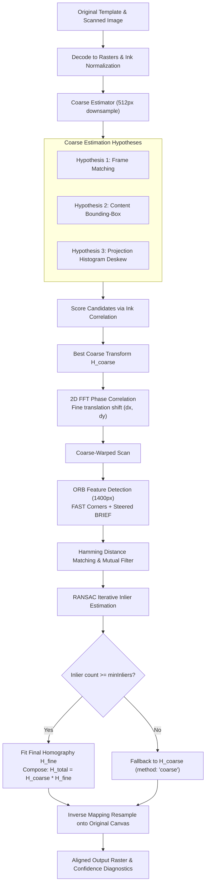
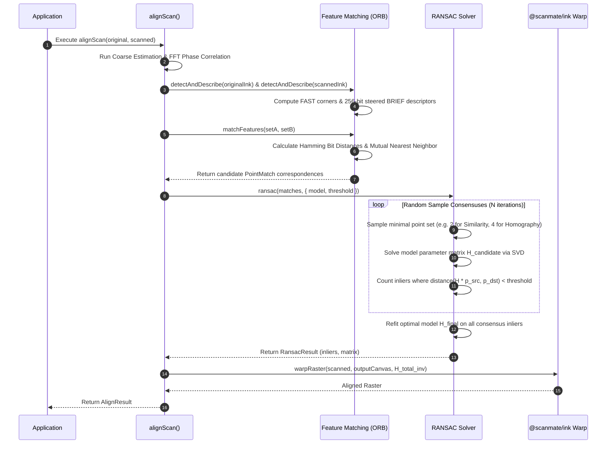

# `@scanmate/align`

> Coarse-to-fine geometric alignment engine for matching scanned pages back onto reference document templates.

`@scanmate/align` resamples photographs or flatbed scans of printed forms onto the exact coordinate canvas of their original digital templates (PDF pages). It solves translation, rotation, scaling, affine shear, and 8-DOF perspective distortions using a multi-hypothesis coarse estimator, Fast Fourier Transform (FFT) phase correlation, oriented FAST + steered BRIEF (ORB) feature matching, and RANSAC geometric model fitting.

---

## Features

- 🎯 **Coordinate Preservation**: Resamples scanned pages directly onto the original PDF canvas dimensions, ensuring bounding box coordinates $(x, y, w, h)$ remain 1:1 comparable.
- 🚀 **Multi-Hypothesis Coarse Estimation**: Guesses transformation candidates via frame matching, content bounding-box matching, and projection-histogram deskewing at low resolution (512px).
- ⚡ **FFT Phase Correlation**: Fine-tunes 2D translational offsets using frequency-domain cross-power spectral density peaks.
- 🔬 **Steered BRIEF & FAST Corners (ORB)**: Detects corners with intensity centroids for scale/rotation invariance without native OpenCV dependencies.
- 🛡️ **RANSAC Model Fitting**: Filters up to 60%+ false matches (e.g. repeated table cells, identical letterforms) using RANdom SAmple Consensus.
- 📐 **Multiple Transformation Models**: Supports `similarity` (4-DOF), `affine` (6-DOF), and `homography` (8-DOF perspective transform).

---

## Installation

```bash
# Using npm
npm install @scanmate/align @scanmate/ink

# Using pnpm
pnpm add @scanmate/align @scanmate/ink

# Using yarn
yarn add @scanmate/align @scanmate/ink
```

---

## Quick Start

```ts
import { alignScan } from '@scanmate/align'
import { decodeImage } from '@scanmate/ink'
import { readFile } from 'node:fs/promises'

const original = await decodeImage(await readFile('template_p1.png'))
const scanned = await decodeImage(await readFile('returned_photo.jpg'))

const result = await alignScan(original, scanned, {
  model: 'similarity',
  workingSize: 1400,
})

console.log(`Confidence: ${(result.confidence * 100).toFixed(1)}%`)
```

---

## Architecture & Algorithm Deep-Dive

### 1. Multi-Stage Coarse-to-Fine Pipeline



---

### 2. Feature Matching & RANSAC Alignment Sequence



---

## Comprehensive API Reference

### 1. Primary Alignment Functions

#### `alignScan(original: ImageInput | Raster, scanned: ImageInput | Raster, options?: AlignOptions): Promise<AlignResult>`
Main entry point to align a single scanned image back onto the original template canvas.
- **Parameters**:
  - `original`: Original template image (file `Buffer`, `Uint8Array`, or decoded `Raster`).
  - `scanned`: Scanned page image (file `Buffer`, `Uint8Array`, or decoded `Raster`).
  - `options` *(optional)*: `AlignOptions` object (see detailed breakdown below).
- **Returns**: `Promise<AlignResult>` containing resampled `raster`, transformation matrices, transform summary, `confidence` score (0.0 to 1.0), `method` (`'features'` | `'coarse'`), and diagnostics.

##### Detailed Options Explanation (`AlignOptions`):

| Option | Type | Default | Description & Impact |
|---|---|---|---|
| `model` | `'similarity' \| 'affine' \| 'homography'` | `'similarity'` | Mathematical transformation model to fit. `similarity` (4-DOF) solves scale, rotation, translation; `affine` (6-DOF) adds axis shear; `homography` (8-DOF) solves perspective tilt. |
| `workingSize` | `number` | `1400` | Maximum dimension (width/height in px) to downscale images for feature detection. Higher values increase accuracy for faint text but increase execution time quadratically. |
| `coarseSize` | `number` | `512` | Maximum dimension for the fast initial coarse estimation sweep. |
| `maxFeatures` | `number` | `1200` | Maximum budget of ORB keypoints to detect per image. |
| `ransacThreshold` | `number` | `3.0` | Maximum reprojection distance in working-resolution pixels to consider a feature match an inlier during RANSAC. |
| `minInliers` | `number` | `12` | Minimum required RANSAC inlier matches. If inlier count is below this, feature stage is rejected and method falls back to `'coarse'`. |
| `maxSkewDeg` | `number` | `12.0` | Maximum page tilt angle considered during projection histogram deskewing. |
| `interpolation` | `'bilinear' \| 'bicubic' \| 'nearest'` | `'bilinear'` | Sub-pixel interpolation kernel used when inverse warping the scan onto the output canvas. |
| `background` | `Rgba` (`[r,g,b,a]`) | `[255,255,255,255]` | RGBA background fill color for canvas areas not covered by the warped scan. |
| `output` | `'png' \| 'jpeg' \| 'none'` | `'png'` | Format for encoded output bytes in `result.image`. Set to `'none'` if consuming `result.raster` directly to save PNG encoding overhead. |
| `seed` | `number` | `42` | PRNG seed for RANSAC sampling and steered BRIEF patterns, ensuring deterministic output across runs. |

---

#### `alignPages(pages: PagePairing[], options?: AlignPagesOptions): Promise<AlignedPage[]>`
Executes multi-page document alignment in parallel or sequence.
- **Parameters**:
  - `pages`: Array of paired document page objects (`{ pageNumber, original, scanned }`).
  - `options` *(optional)*: Extends `AlignOptions` with `onProgress: (stage: string, progress: number) => void` callback.
- **Returns**: `Promise<AlignedPage[]>`

#### `polishTranslation(original: Raster, aligned: Raster): Matrix3`
Fine-tunes residual 1-2 pixel translational shifts between original and aligned rasters using phase correlation.

---

### 2. Intermediate Pipeline Building Blocks

#### `estimateCoarse(original: Raster, scanned: Raster, options?: CoarseOptions): Promise<CoarseResult>`
Evaluates triple-hypothesis coarse transformation candidates (`frame`, `content`, `deskew`) at low resolution (`coarseSize`).
- **`options`**:
  - `coarseSize` *(default: 512)*: Downscaled image dimension.
  - `maxSkewDeg` *(default: 12)*: Max search skew angle.
- **Returns**: `Promise<CoarseResult>` with best matrix, candidate scores, and downscaled warped gray images.

#### `detectAndDescribe(image: GrayImage, options?: FeatureOptions): FeatureSet`
Detects FAST corners and computes 256-bit steered BRIEF binary descriptors (ORB).
- **`options`**:
  - `maxFeatures` *(default: 1200)*: Keypoint budget cap.
  - `fastThreshold` *(default: 20)*: FAST corner detector intensity difference threshold.
- **Returns**: `FeatureSet` containing `keypoints` (position, angle, response) and `descriptors` (`Uint8Array` of size $N \times 32$).

#### `matchFeatures(setA: FeatureSet, setB: FeatureSet, options?: MatchOptions): PointMatch[]`
Matches binary BRIEF descriptors between two feature sets using Hamming distance.
- **`options`**:
  - `maxDistance` *(default: 64)*: Maximum acceptable Hamming bit error distance (0-256).
  - `crossCheck` *(default: true)*: Enforces mutual nearest-neighbor filter (A must choose B and B must choose A).
- **Returns**: Array of `PointMatch` (`{ src: Point, dst: Point, distance: number }`).

#### `hamming(a: Uint8Array, b: Uint8Array): number` / `popcount(n: number): number`
High-speed bitwise XOR popcount function for computing 256-bit Hamming distance between descriptors.

#### `phaseCorrelate(imageA: GrayImage, imageB: GrayImage): PhaseCorrelationResult`
Computes 2D FFT cross-power spectrum between two gray images to find global translation vector $(dx, dy)$ and correlation peak height.

---

### 3. Model Fitting & RANSAC Solvers

#### `ransac(matches: PointMatch[], options?: RansacOptions): RansacResult`
Iterative RANSAC solver for filtering false feature matches and fitting geometric transformation parameters.
- **`options`**:
  - `model` *(default: `'similarity'`)*: `'similarity'`, `'affine'`, or `'homography'`.
  - `threshold` *(default: 3.0)*: Inlier reprojection error threshold in pixels.
  - `maxIterations` *(default: 2000)*: Max consensus iteration trials.
  - `confidence` *(default: 0.99)*: Theoretical probability of finding optimal inlier set.
  - `seed` *(default: 42)*: PRNG seed.
- **Returns**: `RansacResult` (`{ matrix: Matrix3, inliers: PointMatch[], iterations: number, rmsError: number }`).

#### `fitModel(model: TransformModel, points: PointMatch[]): Matrix3`
Direct non-iterative model fitting solver for specified `model` type on a set of point matches.

#### `fitSimilarity(points: PointMatch[]): Matrix3`
Fits 4-DOF Similarity matrix (Scale, Rotation, Translation) from 2+ point matches using least squares.

#### `fitAffine(points: PointMatch[]): Matrix3`
Fits 6-DOF Affine matrix (Scale X/Y, Rotation, Shear, Translation) from 3+ point matches.

#### `fitHomography(points: PointMatch[]): Matrix3`
Fits 8-DOF Homography matrix ($3 \times 3$ perspective transformation) from 4+ point matches using SVD / eigenvector solver.

#### `findInliers(matches: PointMatch[], matrix: Matrix3, threshold: number): PointMatch[]`
Filters point matches returning only those whose reprojection error under `matrix` is less than `threshold`.

#### `minimumSamples(model: TransformModel): number`
Returns minimum required point correspondences to solve model: `similarity` = 2, `affine` = 3, `homography` = 4.

---

## License

MIT © [ScanMate Team](https://github.com/russoedu/scanmate)
