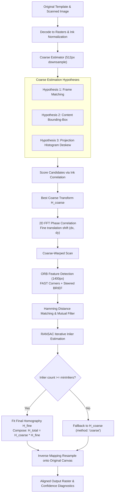
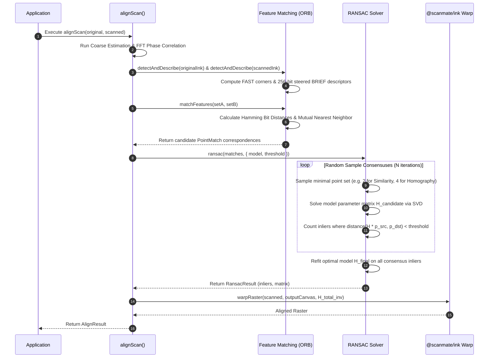

# `@scanmate/align`

> Coarse-to-fine geometric alignment engine for matching scanned pages back onto reference document templates.

`@scanmate/align` resamples photographs or flatbed scans of printed forms onto the exact coordinate canvas of their original digital templates (PDF pages). It solves translation, rotation, scaling, affine shear, and 8-DOF perspective distortions using a multi-hypothesis coarse estimator, Fast Fourier Transform (FFT) phase correlation, oriented FAST + steered BRIEF (ORB) feature matching, and RANSAC geometric model fitting.

---

## Features

- 🎯 **Coordinate Preservation**: Resamples scanned pages directly onto the original PDF canvas dimensions, ensuring bounding box coordinates $(x, y, w, h)$ remain 1:1 comparable.
- 🚀 **Multi-Hypothesis Coarse Estimation**: Guesses transformation candidates via frame matching, content bounding-box matching, and projection-histogram deskewing at low resolution (512px).
- ⚡ **FFT Phase Correlation**: Fine-tunes 2D translational offsets using frequency-domain cross-power spectral density peaks.
- 🔬 **Steered BRIEF & FAST Corners (ORB)**: Detects corners with intensity centroids for scale/rotation invariance without native OpenCV dependencies.
- 🛡️ **RANSAC Model Fitting**: Filters up to 60%+ false matches (e.g. repeated table cells, identical letterforms) using RANdom SAmple Consensus.
- 📐 **Multiple Transformation Models**: Supports `similarity` (4-DOF), `affine` (6-DOF), and `homography` (8-DOF perspective transform).

---

## Installation

```bash
# Using npm
npm install @scanmate/align @scanmate/ink

# Using pnpm
pnpm add @scanmate/align @scanmate/ink

# Using yarn
yarn add @scanmate/align @scanmate/ink
```

---

## Quick Start & Usage

### 1. Aligning a Scanned Image to an Original Template (`alignScan`)

```ts
import { alignScan } from '@scanmate/align'
import { decodeImage } from '@scanmate/ink'
import { readFile } from 'node:fs/promises'

// Decode images into RGBA Rasters
const original = await decodeImage(await readFile('contract_template_p1.png'))
const scanned = await decodeImage(await readFile('returned_photo.jpg'))

// Execute high-precision alignment
const result = await alignScan(original, scanned, {
  model: 'similarity',     // 'similarity' | 'affine' | 'homography'
  workingSize: 1400,        // Resolution cap for feature matching
  coarseSize: 512,          // Resolution cap for coarse estimation
  maxFeatures: 1200,        // Keypoint budget per image
})

console.log(`Confidence Score: ${(result.confidence * 100).toFixed(1)}%`)
console.log(`Rotation: ${result.transform.rotationDeg.toFixed(2)}°`)
console.log(`Scale X: ${result.transform.scaleX.toFixed(3)}, Scale Y: ${result.transform.scaleY.toFixed(3)}`)
console.log(`Alignment Method: ${result.method}`) // 'features' | 'coarse'

// result.raster is now resampled onto original canvas dimensions!
```

### 2. Multi-Page Batch Alignment (`alignPages`)

```ts
import { alignPages } from '@scanmate/align'

// Align an array of extracted original and scanned page pairs
const alignedPages = await alignPages(pagePairs, {
  onProgress: (stage, progress) => {
    console.log(`Progress [${stage}]: ${(progress * 100).toFixed(0)}%`)
  },
})
```

### 3. Pipeline Building Blocks

For advanced pipelines needing custom stops or intermediate inspection:

```ts
import {
  detectAndDescribe,
  estimateCoarse,
  fitModel,
  matchFeatures,
  phaseCorrelate,
  ransac,
} from '@scanmate/align'

// Step 1: Low-resolution coarse scale & translation guess
const coarse = await estimateCoarse(originalRaster, scannedRaster)

// Step 2: FFT Phase Correlation for shift refinement
const shift = phaseCorrelate(coarse.warpedGrayOriginal, coarse.warpedGrayScanned)

// Step 3: Feature Detection (FAST + Steered BRIEF)
const originalKeypoints = detectAndDescribe(originalInkMap)
const scannedKeypoints = detectAndDescribe(scannedInkMap)

// Step 4: Hamming Distance Feature Matching
const matches = matchFeatures(originalKeypoints, scannedKeypoints)

// Step 5: RANSAC Outlier Filtering
const ransacResult = ransac(matches, { model: 'similarity', threshold: 3.0 })
```

---

## Architecture & Algorithm Deep-Dive

### 1. Multi-Stage Coarse-to-Fine Pipeline



---

### 2. Feature Matching & RANSAC Alignment Sequence



---

### 3. Model Comparison & Choice

| Model | DOF | Parameters | Minimal Samples | Ideal Use Case |
|---|:---:|---|:---:|---|
| **`similarity`** *(default)* | 4 | Rotation, Uniform Scale, Translation $(tx, ty)$ | 2 points | Flatbed & sheet-fed scanner images where document plane is flat. |
| **`affine`** | 6 | Rotation, Independent Scale $(sx, sy)$, Shear, Translation | 3 points | Scans with non-uniform axis stretching (e.g. slipping feed rollers). |
| **`homography`** | 8 | Perspective projection matrix ($3 \times 3$) | 4 points | Photographs taken off-axis or with camera tilt. |

---

## Diagnostics & Confidence Metrics

`alignScan` returns a comprehensive `AlignResult` object:

```ts
interface AlignResult {
  raster: Raster                  // Aligned scan resampled to original canvas
  image: Uint8Array | null        // Encoded bytes (PNG/JPEG) if requested
  matrix: Matrix3                 // Original -> Scanned transformation matrix
  inverse: Matrix3                // Scanned -> Original transformation matrix
  transform: TransformSummary     // Extracted scaleX, scaleY, rotationDeg, shear
  confidence: number              // 0.0 to 1.0 ink correlation after warping
  method: 'features' | 'coarse'   // Method used for final alignment
  diagnostics: AlignDiagnostics   // Detailed execution timing and model scores
}
```

> [!TIP]
> A `confidence` score **> 0.60** indicates a solid registration match on printed documents. Confidence **< 0.35** suggests significant misalignment or non-matching document templates.

---

## License

MIT © [ScanMate Team](https://github.com/russoedu/scanmate)
