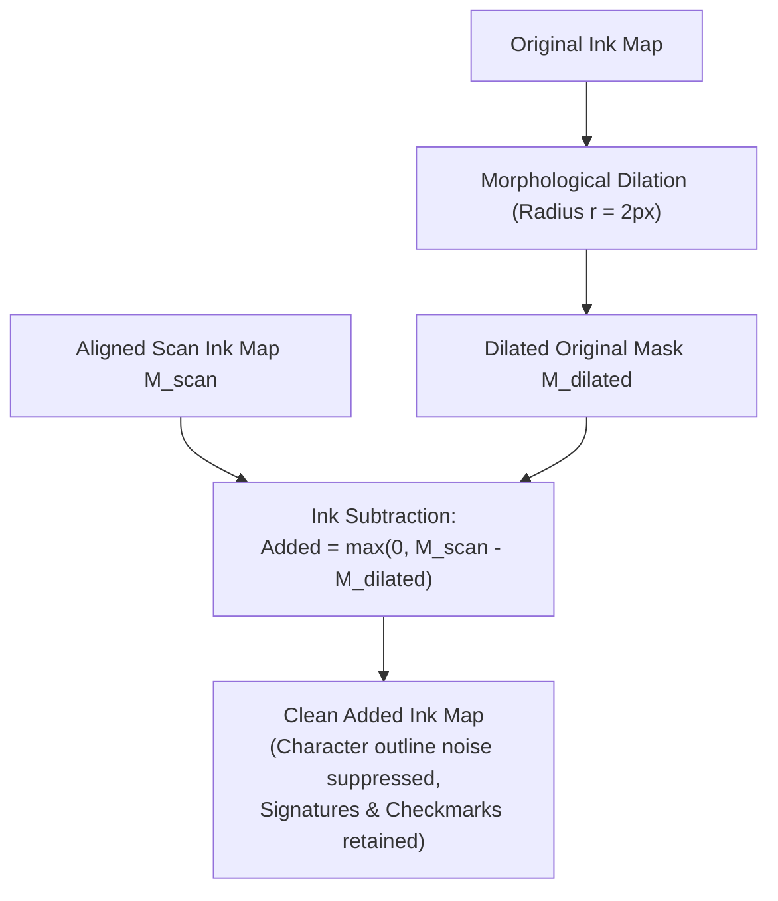
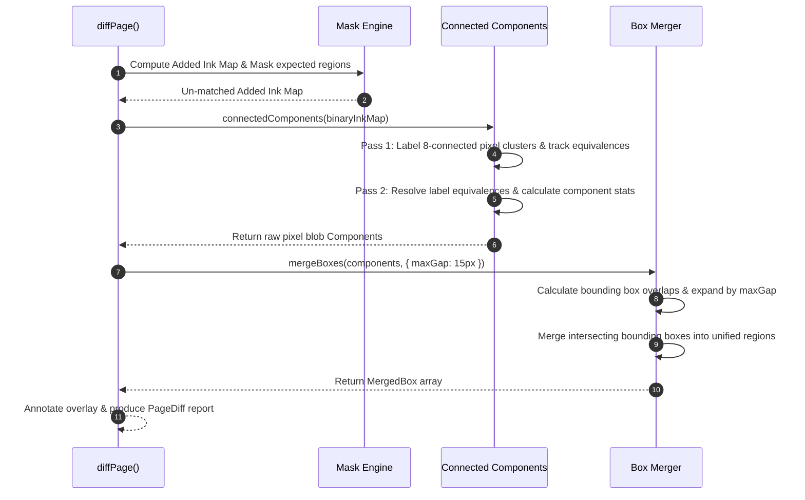

# `@scanmate/diff`

> Visual change detection, form field verification, and unexpected modification analysis for aligned document pairs.

`@scanmate/diff` analyzes differences between original digital document templates and aligned scanned pages. It verifies whether expected form regions (such as signature blocks, checkboxes, and fillable fields) were completed, measures added/removed ink quantities, isolates unexpected handwritten marks or edits using 2-pass connected components analysis, and renders color-coded visual difference overlays.

---

## Features

- ✍️ **Form Region Verification (`compareRegions`)**: Quantifies added ink inside specific bounding boxes in original canvas coordinates.
- 🔍 **Sub-Pixel Dilation Tolerance**: Fattens original ink boundaries before subtraction to eliminate false-positive edge noise caused by minor printing/scanning shifts.
- 🎨 **Color-Coded Visual Overlay (`renderDiff`)**: Produces RGBA difference overlays (Red = added ink / signature, Blue = removed ink, Grey = matching ink).
- 🧩 **Unexpected Mark Isolation (`diffPage`)**: Uses 8-connectivity Connected Component Analysis (CCL) to group un-matched ink pixels into isolated bounding boxes.
- 📦 **Automated Box Merging**: Consolidates adjacent connected components to present clean, readable change boxes around handwritten notes or stamps.

---

## Installation

```bash
# Using npm
npm install @scanmate/diff @scanmate/ink

# Using pnpm
pnpm add @scanmate/diff @scanmate/ink

# Using yarn
yarn add @scanmate/diff @scanmate/ink
```

---

## Usage Examples

### 1. Form Region & Signature Verification (`compareRegions`)

```ts
import { compareRegions } from '@scanmate/diff'
import { decodeImage } from '@scanmate/ink'

const original = await decodeImage(originalBuffer)
const aligned = await decodeImage(alignedBuffer) // Must be aligned via @scanmate/align!

// Define regions in original PDF canvas coordinates
const reports = compareRegions(original, aligned, [
  { id: 'signature', rect: { x: 100, y: 750, width: 350, height: 80 } },
  { id: 'consent_checkbox', rect: { x: 100, y: 650, width: 20, height: 20 }, threshold: 0.05 },
])

for (const report of reports) {
  console.log(`Region [${report.id}]: filled = ${report.filled}, added ink ratio = ${(report.added * 100).toFixed(2)}%`)
}
```

### 2. Generating Visual Difference Overlays (`renderDiff`)

```ts
import { renderDiff } from '@scanmate/diff'
import { encodeImage } from '@scanmate/ink'
import { writeFile } from 'node:fs/promises'

// Render color-coded difference image
const diffRaster = renderDiff(original, aligned, {
  addedColor: [239, 68, 68, 255],   // Red for scan additions (e.g. signature)
  removedColor: [59, 130, 246, 255], // Blue for scan deletions
  matchedColor: [156, 163, 175, 255],// Grey for matching template ink
})

const pngBytes = await encodeImage(diffRaster, { format: 'png' })
await writeFile('diff_overlay.png', pngBytes)
```

### 3. Detecting Unexpected Handwritten Modifications (`diffPage`)

```ts
import { diffPage } from '@scanmate/diff'

// Detect expected form entries and highlight unexpected extra marks
const pageDiff = await diffPage({
  page: 1,
  original,
  aligned,
  expectedRegions: [
    { id: 'client_signature', x: 100, y: 800, width: 300, height: 60 },
  ],
  minChangePixels: 20, // Ignore tiny dust spots smaller than 20 px
})

console.log('Expected Regions Result:', pageDiff.expected)
console.log('Unexpected Changes Found:', pageDiff.unexpected)
// pageDiff.unexpected contains bounding boxes of unauthorized edits or marginal notes
```

---

## Architecture & Algorithm Deep-Dive

### 1. Dilation Masking & Sub-Pixel Tolerance

Even when a scan is perfectly aligned, real-world printing and scanning artifacts (ink bleed, scanner MTF blur, rasterization anti-aliasing) create sub-pixel outline differences along text character edges. Subtracting raw ink maps directly produces false-positive "halos" around every letter on the page.

To prevent this, `@scanmate/diff` applies **morphological dilation** with radius $r$ (default 2px) to the original template's ink map $M_{orig}$:

$$M_{orig, dilated} = \text{dilate}(M_{orig}, r)$$

$$\text{Ink}_{added}(x, y) = \max\left(0, \text{Ink}_{scan}(x, y) - M_{orig, dilated}(x, y)\right)$$



---

### 2. Connected Component Analysis & Unexpected Mark Grouping



---

### 3. Region Report Metrics

When evaluating a bounding box $\mathcal{R}$, `@scanmate/diff` computes the following ratios:

- **`added`**: Fraction of region area containing ink in scan that was not in original template:
  $$\text{added} = \frac{\sum_{(x,y) \in \mathcal{R}} \text{Ink}_{added}(x,y)}{|\mathcal{R}|}$$
- **`removed`**: Fraction of original template ink missing in scan.
- **`filled`**: Boolean flag set to `true` when $\text{added} \ge \text{threshold}$ (default 2% of region area).

---

## API Reference Overview

### Core Functions
- **`compareRegions(original, aligned, regions, options?)`**: Returns an array of `RegionReport` objects for specified bounding boxes.
- **`diffDocument(original, aligned, regions?, options?)`**: Computes whole-page and per-region added/removed ink metrics in a single pass.
- **`renderDiff(original, aligned, options?)`**: Creates a color-coded RGBA `Raster` overlay.
- **`diffPage(options)`**: Executes full expected region matching + 2-pass connected components analysis for unexpected change detection.

---

## License

MIT © [ScanMate Team](https://github.com/russoedu/scanmate)
