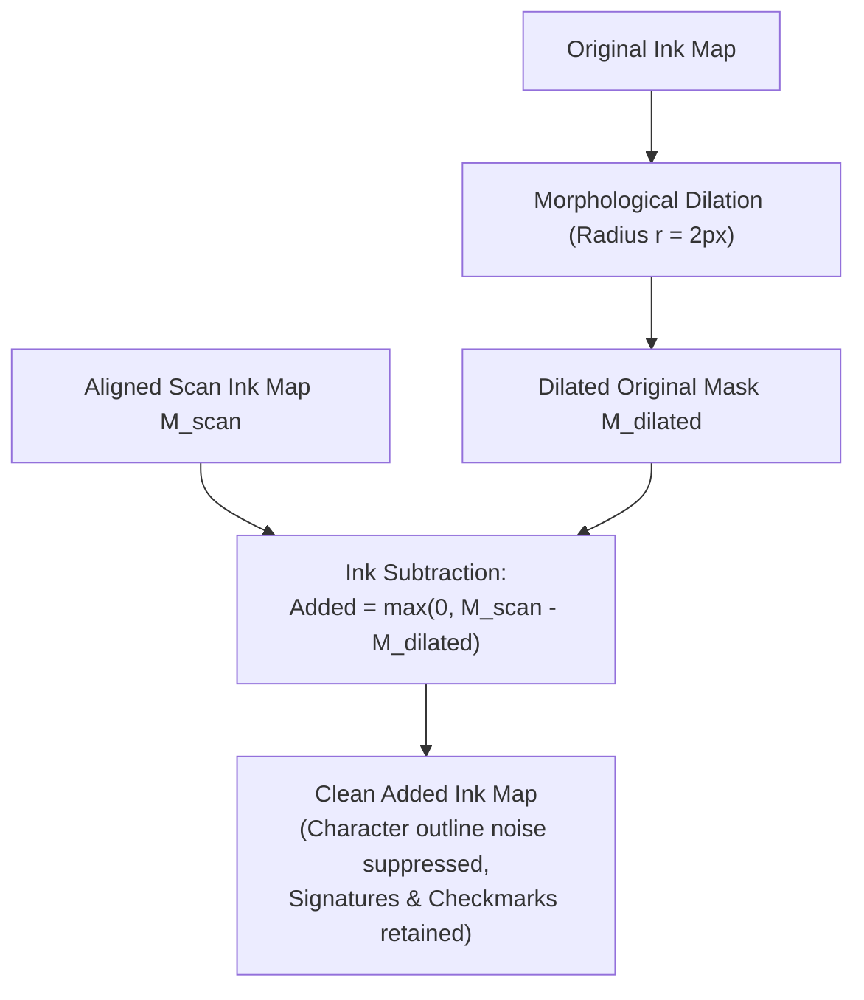
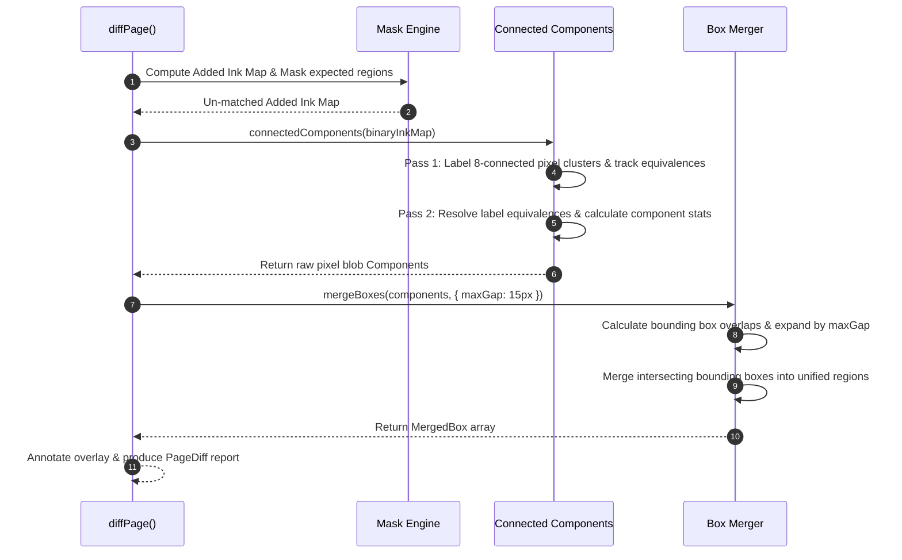

# `@scanmate/diff`

> Visual change detection, form field verification, and unexpected modification analysis for aligned document pairs.

`@scanmate/diff` analyzes differences between original digital document templates and aligned scanned pages. It verifies whether expected form regions (such as signature blocks, checkboxes, and fillable fields) were completed, measures added/removed ink quantities, isolates unexpected handwritten marks or edits using 2-pass connected components analysis, and renders color-coded visual difference overlays.

---

## Features

- ✍️ **Form Region Verification (`compareRegions`)**: Quantifies added ink inside specific bounding boxes in original canvas coordinates.
- 🔍 **Sub-Pixel Dilation Tolerance**: Fattens original ink boundaries before subtraction to eliminate false-positive edge noise caused by minor printing/scanning shifts.
- 🎨 **Color-Coded Visual Overlay (`renderDiff`)**: Produces RGBA difference overlays (Red = added ink / signature, Blue = removed ink, Grey = matching ink).
- 🧩 **Unexpected Mark Isolation (`diffPage`)**: Uses 8-connectivity Connected Component Analysis (CCL) to group un-matched ink pixels into isolated bounding boxes.
- 📦 **Automated Box Merging**: Consolidates adjacent connected components to present clean, readable change boxes around handwritten notes or stamps.

---

## Installation

```bash
# Using npm
npm install @scanmate/diff @scanmate/ink

# Using pnpm
pnpm add @scanmate/diff @scanmate/ink

# Using yarn
yarn add @scanmate/diff @scanmate/ink
```

---

## Quick Start

```ts
import { compareRegions } from '@scanmate/diff'
import { decodeImage } from '@scanmate/ink'

const original = await decodeImage(originalBuffer)
const aligned = await decodeImage(alignedBuffer)

const reports = compareRegions(original, aligned, [
  { id: 'signature', rect: { x: 100, y: 750, width: 350, height: 80 } },
])
```

---

## Architecture & Algorithm Deep-Dive

### 1. Dilation Masking & Sub-Pixel Tolerance

Even when a scan is perfectly aligned, real-world printing and scanning artifacts (ink bleed, scanner MTF blur, rasterization anti-aliasing) create sub-pixel outline differences along text character edges. Subtracting raw ink maps directly produces false-positive "halos" around every letter on the page.

To prevent this, `@scanmate/diff` applies **morphological dilation** with radius $r$ (default 2px) to the original template's ink map $M_{orig}$:

$$M_{orig, dilated} = \text{dilate}(M_{orig}, r)$$

$$\text{Ink}_{added}(x, y) = \max\left(0, \text{Ink}_{scan}(x, y) - M_{orig, dilated}(x, y)\right)$$



---

### 2. Connected Component Analysis & Unexpected Mark Grouping



---

## Comprehensive API Reference

### 1. Region Comparison & Form Verification

#### `compareRegions(original: Raster, aligned: Raster, regions: Region[], options?: RegionOptions): RegionReport[]`
Evaluates specific rectangular form regions to check if signatures, checkboxes, or text boxes were filled in.
- **Parameters**:
  - `original`: Original template `Raster`.
  - `aligned`: Aligned scan `Raster` (must match `original` canvas width/height).
  - `regions`: Array of `Region` objects (`{ id: string, rect: Rect, threshold?: number }`).
  - `options` *(optional)*: `RegionOptions` object (see breakdown below).
- **Returns**: Array of `RegionReport` (`{ id, rect, filled, score, added, removed, addedPixels, totalPixels }`).

##### Detailed Options Explanation (`RegionOptions`):

| Option | Type | Default | Description & Impact |
|---|---|---|---|
| `tolerance` | `number` | `2` | Morphological dilation radius in pixels applied to original ink before subtraction. Absorbs minor sub-pixel rendering shifts. |
| `threshold` | `number` | `0.02` | Ink ratio threshold (2% of region area) above which `filled` is set to `true`. |
| `addedColor` | `Rgba` | `[239, 68, 68, 255]` | RGBA color (Red) for added ink in diff overlays. |
| `removedColor` | `Rgba` | `[59, 130, 246, 255]` | RGBA color (Blue) for removed ink in diff overlays. |
| `matchedColor` | `Rgba` | `[156, 163, 175, 255]`| RGBA color (Grey) for matching ink in diff overlays. |

---

#### `diffDocument(original: Raster, aligned: Raster, regions?: Region[], options?: RegionOptions): DocumentDiff`
Computes whole-page added/removed ink statistics plus per-region details in a single efficient pass.
- **Returns**: `DocumentDiff` (`{ overallAdded, overallRemoved, overallAddedPixels, overallTotalPixels, regions: RegionReport[] }`).

#### `renderDiff(original: Raster, aligned: Raster, options?: RegionOptions): Raster`
Generates a 4-color RGBA overlay `Raster` suitable for visual inspection (Red = scan additions, Blue = template deletions, Grey = matched ink, White = paper background).

---

### 2. High-Level Page & Document Diffing

#### `diffPage(options: DiffOptions): Promise<PageDiff>`
Full change detection pipeline for a single page, matching expected form regions and isolating unexpected handwritten edits using connected component analysis.
- **Parameters (`DiffOptions`)**:
  - `page`: Page number index.
  - `original`: Original template `Raster`.
  - `aligned`: Aligned scan `Raster`.
  - `expectedRegions` *(optional)*: Array of expected form field bounding boxes.
  - `minChangePixels` *(default: 20)*: Minimum area in pixels to consider a connected component a valid unexpected change box.
  - `tolerance` *(default: 2)*: Dilation tolerance radius.
  - `addedColor` / `removedColor`: Visual overlay colors.
- **Returns**: `Promise<PageDiff>` (`{ page, expected: ExpectedResult[], unexpected: UnexpectedChange[], overlay: Raster }`).

#### `diffPages(alignedPages: AlignedPage[], expectedRegions: ExpectedRegion[], options?: DiffOptions): Promise<PageDiff[]>`
Batch page diffing for multi-page document collections.

---

### 3. Pipeline Building Blocks & Connected Components

#### `buildMasks(original: Raster, aligned: Raster, options?: RegionOptions): Masks`
Computes intermediate Float32 ink maps and binary addition/subtraction masks.
- **Returns**: `Masks` (`{ originalInk, alignedInk, addedMask, removedMask, width, height }`).

#### `measureRegion(masks: Masks, region: Region, options?: RegionOptions): RegionReport`
Measures ink statistics inside a single `Region` using pre-computed `Masks`.

#### `paintOverlay(masks: Masks, options?: RegionOptions): Raster`
Paints RGBA overlay `Raster` from pre-computed `Masks`.

#### `connectedComponents(binary: BinaryImage, options?: ComponentOptions): Component[]`
Executes 2-pass 8-connectivity Connected Component Analysis (CCL) to extract disjoint pixel blobs.
- **Options**:
  - `minPixels` *(default: 1)*: Ignore components with pixel count below this limit.
- **Returns**: Array of `Component` (`{ id, minX, minY, maxX, maxY, pixelCount, width, height }`).

#### `mergeBoxes(boxes: MergedBox[], options?: MergeOptions): MergedBox[]`
Consolidates overlapping or closely adjacent bounding boxes.
- **Options**:
  - `maxGap` *(default: 15)*: Maximum distance in pixels between box boundaries to trigger a box merge.

#### `annotateOverlay(overlay: Raster, annotations: Annotation[], options?: LabelOptions): Raster`
Draws bounding box rectangles and text labels onto a diff overlay `Raster`.

---

## License

MIT © [ScanMate Team](https://github.com/russoedu/scanmate)
