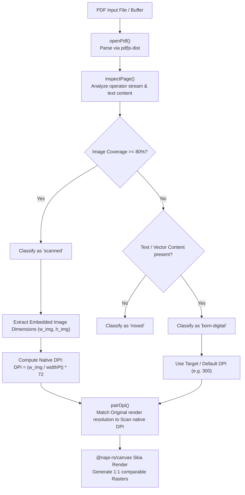
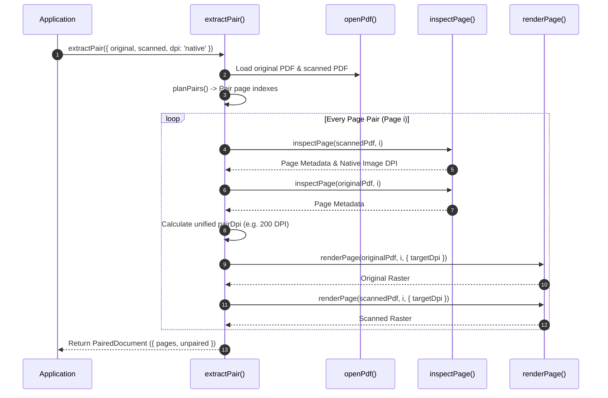

# `@scanmate/extract`

> PDF document parsing, page structure inspection, native DPI determination, and Skia canvas rasterization.

`@scanmate/extract` converts single-page or multi-page PDF documents into pixel-perfect RGBA `Raster` pairs ready for document alignment and comparison. Powered by `pdfjs-dist` for PDF object parsing and `@napi-rs/canvas` (prebuilt Skia bindings) for drawing, it inspects embedded vector layers vs. raster images, automatically determines native scanner DPI, and pairs original templates with incoming scans.

---

## Features

- 📑 **Page Structure Classification (`classifyPage`)**: Inspects PDF operators to determine if a page is `'born-digital'`, `'scanned'`, or `'mixed'` based on image coverage ($>80\%$).
- 📏 **Native DPI Auto-Resolution (`pairDpi`)**: Calculates native DPI of embedded scan streams so both template and scan are rendered at identical 1:1 pixel resolutions.
- 🎨 **Skia Canvas Engine**: Uses `@napi-rs/canvas` for fast, zero-system-dependency PDF vector and image rasterization.
- 🔗 **Document & Stream Pairing (`extractPair`)**: Pairs multi-page original PDFs with returned multi-page scans, supporting custom page ranges and memory-efficient async streams.
- 🧪 **Synthetic PDF Generator (`createSyntheticPdf`)**: Renders vector test PDFs with text, lines, tables, and images for test suites and smoke testing.

---

## Installation

```bash
# Using npm
npm install @scanmate/extract @scanmate/ink

# Using pnpm
pnpm add @scanmate/extract @scanmate/ink

# Using yarn
yarn add @scanmate/extract @scanmate/ink
```

---

## Usage Examples

### 1. Extracting Document Pairs (`extractPair`)

```ts
import { extractPair } from '@scanmate/extract'

// Extract paired pages from original PDF and scanned PDF
const { pages, unpaired } = await extractPair({
  original: 'contract_original.pdf',
  scanned: 'returned_scan.pdf',
  dpi: 'native', // Auto-detect scan DPI and render original at matching resolution
})

for (const pair of pages) {
  console.log(`Page ${pair.pageNumber}: ${pair.original.width}x${pair.original.height} px @ ${pair.dpi} DPI`)
  console.log(`Original Kind: ${pair.original.metadata.kind}, Scanned Kind: ${pair.scanned.metadata.kind}`)
  
  // Hand pair.original.raster and pair.scanned.raster straight to @scanmate/align!
}
```

### 2. Inspecting PDF Metadata & Page Type (`inspectPage`)

```ts
import { inspectPage, openPdf } from '@scanmate/extract'
import { readFile } from 'node:fs/promises'

const pdf = await openPdf(await readFile('document.pdf'))
const metadata = await inspectPage(pdf, 1)

console.log(`Page Dimensions: ${metadata.widthPt}x${metadata.heightPt} points`)
console.log(`Page Classification: ${metadata.kind}`) // 'born-digital' | 'scanned' | 'mixed'
console.log(`Has Text Layer: ${metadata.hasTextLayer}`)
console.log(`Embedded Images Count: ${metadata.images.length}`)
```

### 3. Rendering PDF Pages to Rasters (`renderPage`)

```ts
import { openPdf, renderPage } from '@scanmate/extract'
import { encodeImage } from '@scanmate/ink'
import { writeFile } from 'node:fs/promises'

const pdf = await openPdf('invoice.pdf')

// Render page 1 at 300 DPI
const raster = await renderPage(pdf, 1, { targetDpi: 300 })

const pngBytes = await encodeImage(raster, { format: 'png' })
await writeFile('page1_300dpi.png', pngBytes)
```

---

## Architecture & Algorithm Deep-Dive

### 1. Classification & DPI Resolution Workflow



---

### 2. Document Pair Extraction Sequence (`extractPair`)



---

## API Reference Overview

### Extraction & Streaming
- **`extractPair(options)`**: Extracts paired pages from original and scanned PDF inputs.
- **`extractPairStream(options)`**: Async generator yielding paired pages one by one for large multi-page PDFs.
- **`extractPages(options)`**: Extracts all pages from a single PDF document.

### Inspection & Rendering
- **`openPdf(input)`**: Loads PDF document from file path, `Buffer`, `Uint8Array`, or URL.
- **`inspectPage(pdf, pageNumber)`**: Analyzes PDF page structure, embedded images, and text content.
- **`classifyPage(metadata)`**: Returns `'scanned'`, `'born-digital'`, or `'mixed'`.
- **`renderPage(pdf, pageNumber, options)`**: Renders PDF page to an 8-bit RGBA `Raster`.

---

## License

MIT © [ScanMate Team](https://github.com/russoedu/scanmate)
