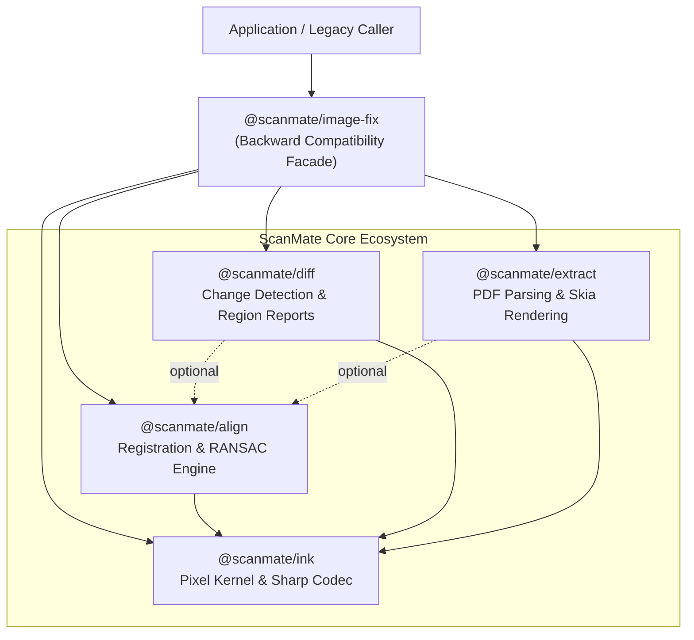
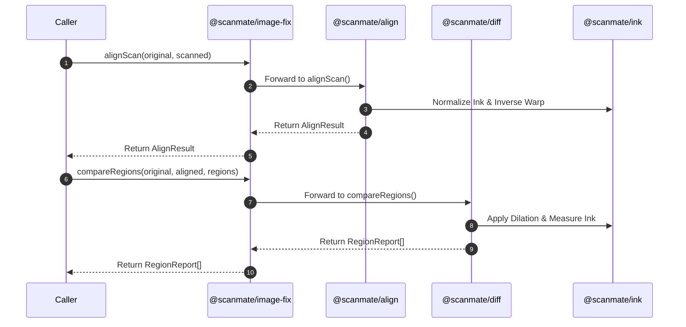

# `@scanmate/image-fix`

> **Deprecated Facade Package.** `@scanmate/image-fix` has been split into focused, modular packages. This package remains available as a backward-compatible facade re-exporting all core APIs.

---

## Modern Package Structure

For all new projects and upgrades, prefer importing directly from the focused packages:

| You used in `@scanmate/image-fix` | Now lives in package | Primary Purpose |
|---|---|---|
| `alignScan`, `alignPages`, `polishTranslation`, estimators | **[`@scanmate/align`](../align)** | Geometric registration & alignment |
| `compareRegions`, `diffDocument`, `renderDiff`, `diffPage` | **[`@scanmate/diff`](../diff)** | Visual change detection & form region verification |
| `decodeImage`, `encodeImage`, `inkMap`, `warpRaster`, `Matrix3` | **[`@scanmate/ink`](../ink)** | Low-level pixel kernel, illumination division & geometry |
| `extractPair`, `extractPages`, `inspectPage`, `renderPage` | **[`@scanmate/extract`](../extract)** | PDF document rendering, inspection & DPI auto-resolution |

---

## Architectural Changes & Breaking Notes

1. **Asynchronous Codec Operations**: All functions that encode or decode images (`decodeImage`, `encodeImage`, `alignScan`, `compareRegions`, `diffDocument`, `renderDiff`) are now **asynchronous** (`Promise`-based) because the image codec migrated to libvips via `sharp`. This yields a **~20x speedup** when encoding full-page PNGs and enables native support for TIFF, HEIF, WebP, and AVIF formats.
2. **Metadata Inspection**: `sniffFormat` has been replaced by `readImageMetadata` in `@scanmate/ink`.

---

## Installation

```bash
# Using npm
npm install @scanmate/image-fix

# Or install the modular packages directly:
npm install @scanmate/align @scanmate/diff @scanmate/ink @scanmate/extract
```

---

## Legacy Quick Start

```ts
import { alignScan, compareRegions, decodeImage } from '@scanmate/image-fix'
import { readFile } from 'node:fs/promises'

// 1. Decode original template and returned scan
const original = await decodeImage(await readFile('contract_p1.png'))
const scanned = await decodeImage(await readFile('returned_scan.jpg'))

// 2. Align scan to original template canvas
const result = await alignScan(original, scanned, { model: 'similarity' })

console.log(`Alignment Confidence: ${(result.confidence * 100).toFixed(1)}%`)
console.log(`Rotation Angle: ${result.transform.rotationDeg.toFixed(2)}°`)

// 3. Verify signature block inside original canvas coordinates
const [sigReport] = compareRegions(original, result.raster, [
  { id: 'signature', rect: { x: 76, y: 905, width: 420, height: 78 } },
])

console.log(`Signature Present: ${sigReport.filled}`)
console.log(`Added Ink Density: ${(sigReport.added * 100).toFixed(2)}%`)
```

---

## Facade Architecture & Dependency Topology



---

## Re-Export Mapping



---

## License

MIT © [ScanMate Team](https://github.com/russoedu/scanmate)
