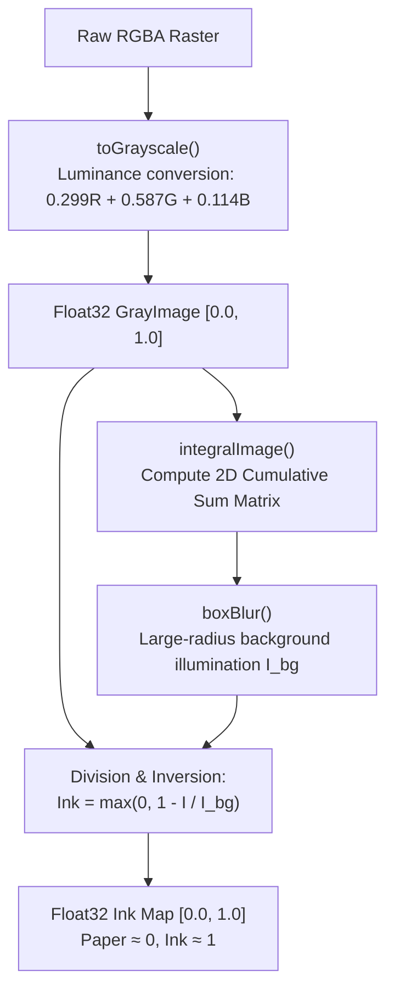
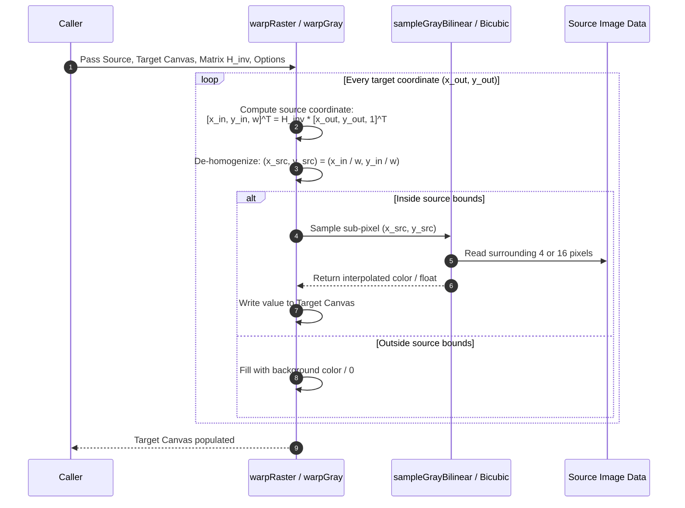
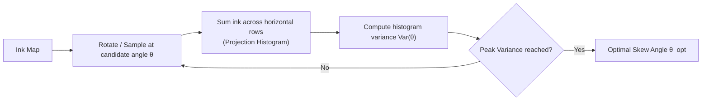

# `@scanmate/ink`

> The pixel and geometry kernel powering ScanMate's document processing pipeline.

`@scanmate/ink` is a high-performance, zero-native-runtime-dependency (except high-speed libvips image codecs via `sharp`) image processing kernel for node environments. It handles illumination normalization, background division, grayscale-to-ink conversion, high-precision bilinear/bicubic resampling, 3x3 homography matrix transforms, FFT frequency analysis, and synthetic document creation.

---

## Features

- 🎨 **Illumination-Invariant Ink Mapping**: Normalizes uneven scanner/camera lighting by dividing grayscale values by their locally-blurred background.
- ⚡ **Asynchronous Libvips Codec**: Decodes and encodes PNG, JPEG, TIFF, WebP, AVIF, and HEIF images 20x faster than pure-JS alternatives via `sharp`.
- 📐 **Float32 Precision**: Uses `Float32Array` representations for gray images to retain low-contrast strokes without quantization loss.
- 🔄 **3x3 Homography & Resampling Engine**: High-speed hand-written matrix inverse mapping, bilinear/bicubic interpolation, and pre-filtered downscaling.
- 📊 **Numerical & Spectral Analysis**: 2D Fast Fourier Transforms (FFT), projection histogram skew estimation, and Jacobi eigenvalue solvers.
- 🧪 **Synthetic Document Generator**: Built-in test fixtures for creating synthetic printed pages, signatures, tick marks, and realistic scan degradation.

---

## Installation

```bash
# Using npm
npm install @scanmate/ink

# Using pnpm
pnpm add @scanmate/ink

# Using yarn
yarn add @scanmate/ink
```

---

## Basic Usage

### 1. Decoding & Encoding Images

```ts
import { decodeImage, encodeImage, readImageMetadata } from '@scanmate/ink'
import { readFile, writeFile } from 'node:fs/promises'

// Read image metadata (dimensions, format, channels, EXIF orientation)
const meta = await readImageMetadata(await readFile('scan.jpg'))
console.log(`Scan size: ${meta.width}x${meta.height}, format: ${meta.format}`)

// Decode into raw 8-bit RGBA Raster format
const raster = await decodeImage(await readFile('scan.jpg'))
console.log(`Raster length: ${raster.data.length} bytes (width: ${raster.width}, height: ${raster.height})`)

// Process raster... (e.g. normalize ink, warp)

// Encode back to PNG or JPEG
const pngBytes = await encodeImage(raster, { format: 'png' })
await writeFile('output.png', pngBytes)
```

### 2. Illumination Normalization (`inkMap`)

Shadows, uneven lighting, and paper yellowing cause raw grayscale values to vary across a scanned document. `inkMap` divides the image by a coarse background estimate and inverts the result, yielding an ink density array where blank paper is near 0.0 and printed ink is near 1.0.

```ts
import { decodeImage, inkMap, toGrayscale } from '@scanmate/ink'

const raster = await decodeImage(scannedBuffer)

// Convert RGBA to Float32 grayscale (0.0 to 1.0)
const gray = toGrayscale(raster)

// Convert grayscale to ink map (background normalization)
const ink = inkMap(gray, { blurRadius: 25 })
// ink.data is Float32Array where 0 = clean paper, 1 = dark ink
```

### 3. Measuring Page Skew (`estimateSkew`)

```ts
import { estimateSkew, inkMap, toGrayscale } from '@scanmate/ink'

const gray = toGrayscale(raster)
const ink = inkMap(gray)

// Estimate page skew angle using projection histograms
const skewDeg = estimateSkew(ink, { maxSkewDeg: 10, stepDeg: 0.1 })
console.log(`Detected skew: ${skewDeg.toFixed(2)} degrees`)
```

### 4. Resampling & Warping (`warpRaster`)

```ts
import { createRaster, invert, translation, warpRaster } from '@scanmate/ink'

// Define 3x3 homography matrix (e.g. shift 50px right, 30px down)
const matrix = translation(50, 30)
const invMatrix = invert(matrix)!

// Prepare output canvas
const output = createRaster(1000, 1400)

// Perform inverse mapping warp
warpRaster(sourceRaster, output, invMatrix, { interpolation: 'bilinear' })
```

---

## Architecture & Algorithm Deep-Dive

### 1. Ink Separation & Background Division

Standard thresholding and grayscale diffing break when lighting changes across the page. Illumination in document imaging is multiplicative: shadows attenuate light by a scaling factor $S(x, y)$, rather than subtracting a constant offset.

$$I_{observed}(x, y) = I_{reflectance}(x, y) \cdot S(x, y)$$

To isolate true ink reflectance $I_{reflectance}$, `@scanmate/ink` estimates background illumination $I_{bg}(x, y)$ using a large-radius box blur or integral image box filter, and evaluates normalized ink density:

$$I_{ink}(x, y) = \max\left(0, 1 - \frac{I(x, y)}{I_{bg}(x, y)}\right)$$



---

### 2. Resampling & Image Warping Workflow

Forward mapping (pushing source pixels into destination coordinates) produces pinholes and moiré artifacts when images are rotated or expanded. `@scanmate/ink` uses **inverse mapping**: for each pixel in the target canvas, it multiplies by the inverse 3x3 transformation matrix $H^{-1}$ to look back into the source image.



---

### 3. Skew Estimation via Projection Histograms

Text pages exhibit strong horizontal line structure. When a page is perfectly level ($0^\circ$), horizontal line sums of ink density produce a comb of tall spikes separated by zero-ink gaps between text rows. When the page is tilted, text lines smear across multiple row bins.

$$\text{Variance}(\theta) = \operatorname{Var}\left( \sum_{x} I_{\text{ink}}(x, y \cos\theta - x \sin\theta) \right)$$

`estimateSkew` evaluates projection variance across candidate angles $\theta \in [-\theta_{max}, \theta_{max}]$ and identifies the peak angle.



---

## API Reference Overview

### Image Structures & Codec
- **`Raster`**: Raw 8-bit RGBA image object (`{ width, height, data: Uint8Array }`).
- **`GrayImage`**: High-precision 32-bit float grayscale image (`{ width, height, data: Float32Array }`).
- **`decodeImage(buffer, options?)`**: Decodes buffer to `Raster` asynchronously via `sharp`.
- **`encodeImage(raster, options?)`**: Encodes `Raster` to PNG, JPEG, or WebP bytes asynchronously.

### Ink Processing
- **`toGrayscale(raster)`**: Converts RGBA `Raster` to `GrayImage`.
- **`inkMap(gray, options?)`**: Performs background division and returns Float32 ink density map.
- **`otsuThreshold(gray)`**: Computes optimal global threshold using Otsu's method.
- **`binarize(gray, threshold?)`**: Converts continuous grayscale to 0/255 binary image.
- **`dilate(binary, radius)`**: Morphological dilation to expand ink regions.

### Geometry & Matrix Math
- **`Matrix3`**: $3 \times 3$ column-major matrix array representation (`[m00, m10, m20, m01, m11, m21, m02, m12, m22]`).
- **`invert(matrix)`**: Computes $3 \times 3$ matrix inverse (returns `null` if singular).
- **`multiply(a, b)`**: Matrix multiplication $A \cdot B$.
- **`decompose(matrix)`**: Extracts scale, rotation angle, translation, and shear from matrix.
- **`similarity(scale, rotationDeg, tx, ty)`**: Constructs a 4-DOF similarity matrix.

---

## License

MIT © [ScanMate Team](https://github.com/russoedu/scanmate)
