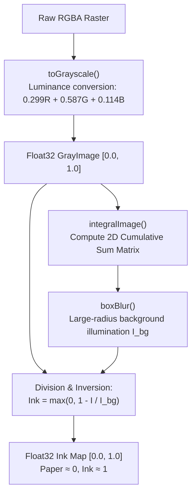
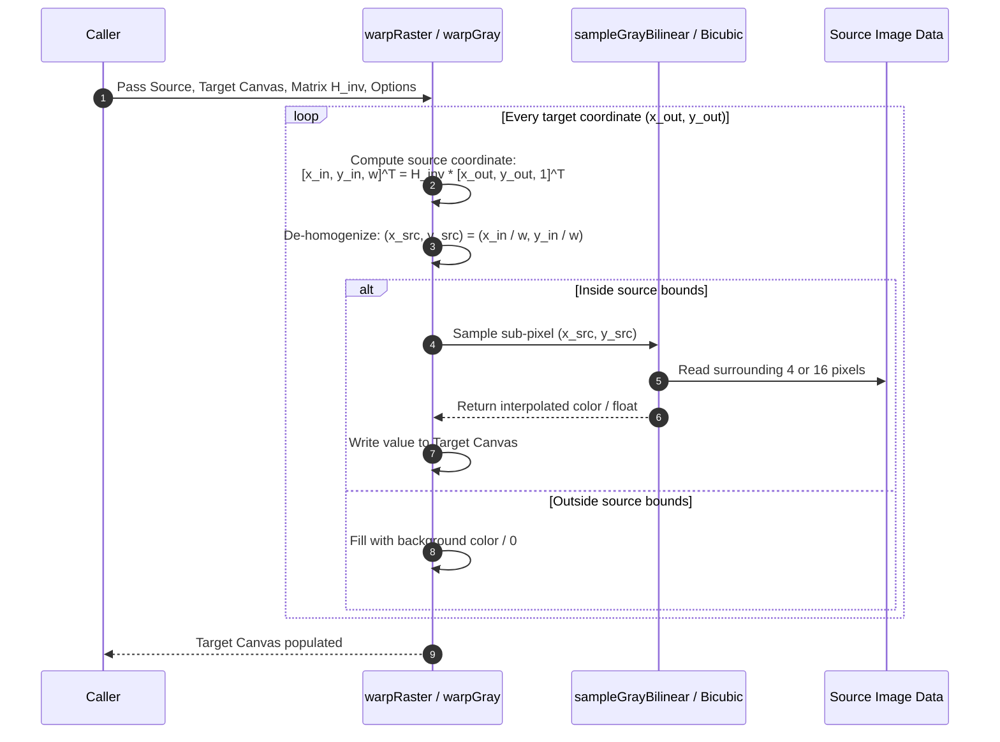

# `@scanmate/ink`

> The pixel and geometry kernel powering ScanMate's document processing pipeline.

`@scanmate/ink` is a high-performance, zero-native-runtime-dependency (except high-speed libvips image codecs via `sharp`) image processing kernel for Node.js environments. It handles illumination normalization, background division, grayscale-to-ink conversion, high-precision bilinear/bicubic resampling, 3x3 homography matrix transforms, FFT frequency analysis, and synthetic document creation.

---

## Features

- 🎨 **Illumination-Invariant Ink Mapping**: Normalizes uneven scanner/camera lighting by dividing grayscale values by their locally-blurred background.
- ⚡ **Asynchronous Libvips Codec**: Decodes and encodes PNG, JPEG, TIFF, WebP, AVIF, and HEIF images 20x faster than pure-JS alternatives via `sharp`.
- 📐 **Float32 Precision**: Uses `Float32Array` representations for gray images to retain low-contrast strokes without quantization loss.
- 🔄 **3x3 Homography & Resampling Engine**: High-speed hand-written matrix inverse mapping, bilinear/bicubic interpolation, and pre-filtered downscaling.
- 📊 **Numerical & Spectral Analysis**: 2D Fast Fourier Transforms (FFT), projection histogram skew estimation, and Jacobi eigenvalue solvers.
- 🧪 **Synthetic Document Generator**: Built-in test fixtures for creating synthetic printed pages, signatures, tick marks, and realistic scan degradation.

---

## Installation

```bash
# Using npm
npm install @scanmate/ink

# Using pnpm
pnpm add @scanmate/ink

# Using yarn
yarn add @scanmate/ink
```

---

## Basic Usage

### 1. Decoding & Encoding Images

```ts
import { decodeImage, encodeImage, readImageMetadata } from '@scanmate/ink'
import { readFile, writeFile } from 'node:fs/promises'

// Read image metadata (dimensions, format, channels, EXIF orientation)
const meta = await readImageMetadata(await readFile('scan.jpg'))
console.log(`Scan size: ${meta.width}x${meta.height}, format: ${meta.format}`)

// Decode into raw 8-bit RGBA Raster format
const raster = await decodeImage(await readFile('scan.jpg'))
console.log(`Raster length: ${raster.data.length} bytes (width: ${raster.width}, height: ${raster.height})`)

// Encode back to PNG or JPEG
const pngBytes = await encodeImage(raster, { format: 'png' })
await writeFile('output.png', pngBytes)
```

### 2. Illumination Normalization (`inkMap`)

```ts
import { decodeImage, inkMap, toGrayscale } from '@scanmate/ink'

const raster = await decodeImage(scannedBuffer)
const gray = toGrayscale(raster)
const ink = inkMap(gray, { blurRadius: 25 })
```

---

## Architecture & Algorithm Deep-Dive

### 1. Ink Separation & Background Division

Standard thresholding and grayscale diffing break when lighting changes across the page. Illumination in document imaging is multiplicative: shadows attenuate light by a scaling factor $S(x, y)$, rather than subtracting a constant offset.

$$I_{observed}(x, y) = I_{reflectance}(x, y) \cdot S(x, y)$$

To isolate true ink reflectance $I_{reflectance}$, `@scanmate/ink` estimates background illumination $I_{bg}(x, y)$ using a large-radius box blur or integral image box filter, and evaluates normalized ink density:

$$I_{ink}(x, y) = \max\left(0, 1 - \frac{I(x, y)}{I_{bg}(x, y)}\right)$$



---

### 2. Resampling & Image Warping Workflow



---

## Comprehensive API Reference

### 1. Image Data Structures & Constructors

#### `createRaster(width: number, height: number, data?: Uint8Array): Raster`
Creates an 8-bit RGBA image buffer object.
- **Parameters**:
  - `width`: Image width in pixels.
  - `height`: Image height in pixels.
  - `data` *(optional)*: `Uint8Array` of size `width * height * 4`. If omitted, zeroed buffer is allocated.
- **Returns**: `Raster` object (`{ width, height, data }`).

#### `createGray(width: number, height: number, data?: Float32Array): GrayImage`
Creates a 32-bit single-channel floating point image buffer object (values $0.0$ to $1.0$).
- **Parameters**:
  - `width`: Width in pixels.
  - `height`: Height in pixels.
  - `data` *(optional)*: `Float32Array` of size `width * height`.
- **Returns**: `GrayImage` object (`{ width, height, data }`).

#### `createBinary(width: number, height: number, data?: Uint8Array): BinaryImage`
Creates a 1-byte-per-pixel binary image ($0$ or $255$).
- **Parameters**:
  - `width`: Width in pixels.
  - `height`: Height in pixels.
  - `data` *(optional)*: `Uint8Array` of size `width * height`.
- **Returns**: `BinaryImage` object (`{ width, height, data }`).

#### `cloneRaster(raster: Raster): Raster`
Performs a deep copy of a `Raster` object.

#### `isRaster(val: unknown): val is Raster`
Type-guard checking if an object conforms to the `Raster` interface.

---

### 2. Codec & File I/O (`sharp` / libvips)

#### `decodeImage(buffer: ImageInput, options?: DecodeOptions): Promise<Raster>`
Decodes an image file buffer into an 8-bit RGBA `Raster`. Supports PNG, JPEG, TIFF, WebP, AVIF, and HEIF formats, honoring EXIF orientation.
- **Parameters**:
  - `buffer`: `Buffer`, `Uint8Array`, or `ArrayBuffer` containing encoded image file bytes.
  - `options` *(optional)*:
    - `pageNumber` *(default: 0)*: Zero-based page index for multi-page TIFF images.
    - `maxWidth` *(optional)*: Downscale long edge during decoding if image exceeds this limit.
    - `maxHeight` *(optional)*: Max height bound for decoder downscaling.
- **Returns**: `Promise<Raster>`

#### `encodeImage(raster: Raster, options?: EncodeOptions): Promise<Uint8Array>`
Encodes an 8-bit RGBA `Raster` to compressed file bytes.
- **Parameters**:
  - `raster`: Input `Raster` object.
  - `options` *(optional)*:
    - `format` *(default: `'png'`)*: Output encoding format (`'png'`, `'jpeg'`, `'webp'`, `'avif'`).
    - `quality` *(default: 80)*: Compression quality factor (1-100) for lossy formats (`jpeg`, `webp`, `avif`).
    - `compression` *(default: 6)*: PNG compression level (0-9).
- **Returns**: `Promise<Uint8Array>`

#### `readImageMetadata(buffer: ImageInput): Promise<ImageMetadata>`
Extracts metadata without full pixel decoding.
- **Parameters**: `buffer` (`Buffer` | `Uint8Array`).
- **Returns**: `Promise<{ width: number, height: number, format: string, channels: number, orientation?: number }>`

#### `countPages(buffer: ImageInput): Promise<number>`
Counts total pages inside multi-page document images (e.g. TIFF).

---

### 3. Ink Normalization & Processing

#### `toGrayscale(raster: Raster): GrayImage`
Converts 8-bit RGBA `Raster` to Float32 `GrayImage` using NTSC luminance weights ($Y = 0.299R + 0.587G + 0.114B$).

#### `inkMap(gray: GrayImage, options?: InkOptions): GrayImage`
Performs background division to produce an illumination-invariant ink density map ($0.0 = \text{paper}$, $1.0 = \text{dark ink}$).
- **Parameters**:
  - `gray`: Input Float32 `GrayImage`.
  - `options` *(optional)*:
    - `blurRadius` *(default: 25)*: Radius in pixels for background estimation blur.
    - `invert` *(default: true)*: If `true`, returns ink density (paper near 0, ink near 1). If `false`, returns normalized reflectance.
    - `clipAreaBoxMean` *(default: false)*: Accelerates background estimation on large documents.
- **Returns**: Float32 `GrayImage`.

#### `otsuThreshold(gray: GrayImage): number`
Computes the optimal global threshold using Otsu's variance maximization method.
- **Returns**: Float threshold value (0.0 to 1.0).

#### `binarize(gray: GrayImage, threshold?: number): BinaryImage`
Thresholds Float32 `GrayImage` to a `BinaryImage` ($0$ or $255$).
- **Options/Parameters**: `threshold` (default: calculated via `otsuThreshold`).

#### `dilate(binary: BinaryImage, radius: number): BinaryImage`
Applies morphological dilation with square kernel of specified `radius` pixels to expand binary ink regions.

#### `boxBlur(gray: GrayImage, radius: number): GrayImage`
Applies $O(1)$ per-pixel sliding box blur to a `GrayImage` using an integral image.

#### `boxBlurRaster(raster: Raster, radius: number): Raster`
Applies box blur directly to an 8-bit RGBA `Raster`.

#### `integralImage(gray: GrayImage): Float64Array`
Computes 2D cumulative sum table (integral image) for $O(1)$ arbitrary rectangle area sums.

#### `coverage(binary: BinaryImage): number`
Calculates the fraction of non-zero ink pixels in a binary image (0.0 to 1.0).

#### `grayToRaster(gray: GrayImage): Raster`
Converts Float32 `GrayImage` ($0..1$) back to an 8-bit RGBA `Raster`.

---

### 4. Geometric Resampling & Warping

#### `warpRaster(raster: Raster, output: Raster, invMatrix: Matrix3, options?: WarpOptions): void`
Resamples input `Raster` onto `output` canvas using inverse transformation matrix $H^{-1}$.
- **Parameters**:
  - `raster`: Source RGBA `Raster`.
  - `output`: Destination target `Raster`.
  - `invMatrix`: Inverse $3 \times 3$ transformation matrix ($H^{-1}$).
  - `options` *(optional)*:
    - `interpolation` *(default: `'bilinear'`)*: Interpolation kernel (`'nearest'`, `'bilinear'`, `'bicubic'`).
    - `background` *(default: `[255, 255, 255, 255]`)*: RGBA color array for pixels mapping outside source bounds.

#### `warpGray(gray: GrayImage, output: GrayImage, invMatrix: Matrix3, options?: WarpOptions): void`
Resamples Float32 `GrayImage` onto target Float32 output canvas.

#### `sampleGrayBilinear(gray: GrayImage, x: number, y: number): number`
Samples sub-pixel value at continuous coordinate $(x, y)$ using bilinear interpolation.

#### `resizeGray(gray: GrayImage, newWidth: number, newHeight: number): GrayImage`
Resizes `GrayImage` to arbitrary new dimensions using pre-filtered downscaling/upscaling.

#### `downscaleGray(gray: GrayImage, factor: number): GrayImage`
Downscales `GrayImage` by an integer `factor` using area-box averaging to avoid moiré aliasing.

---

### 5. Matrix Mathematics (`Matrix3`)

Represented as a 9-element column-major flat array: `[m00, m10, m20, m01, m11, m21, m02, m12, m22]`.

#### `IDENTITY: Matrix3`
Constant $3 \times 3$ Identity matrix (`[1,0,0, 0,1,0, 0,0,1]`).

#### `multiply(a: Matrix3, b: Matrix3): Matrix3`
Multiplies two $3 \times 3$ matrices ($A \cdot B$).

#### `invert(matrix: Matrix3): Matrix3 | null`
Calculates inverse $H^{-1}$. Returns `null` if singular ($\det = 0$).

#### `determinant(matrix: Matrix3): number`
Calculates matrix determinant.

#### `similarity(scale: number, rotationDeg: number, tx: number, ty: number): Matrix3`
Constructs a 4-DOF Similarity transformation matrix.

#### `translation(tx: number, ty: number): Matrix3`
Constructs a translation matrix.

#### `scaling(sx: number, sy?: number): Matrix3`
Constructs a scaling matrix.

#### `decompose(matrix: Matrix3): TransformSummary`
Decomposes matrix into `{ scaleX, scaleY, rotationDeg, shear, translateX, translateY }`.

#### `applyPoint(matrix: Matrix3, point: Point): Point`
Transforms point $(x, y)$ using homography matrix: $[x', y', w]^T = M \cdot [x, y, 1]^T \implies (x'/w, y'/w)$.

#### `mapRectCorners(matrix: Matrix3, rect: Rect): Point[]`
Transforms the 4 corners of a rectangle `Rect`.

#### `rebase(matrix: Matrix3, fromCanvas: Size, toCanvas: Size): Matrix3`
Adjusts transformation matrix when images are rescaled to different canvas sizes.

#### `isPlausible(matrix: Matrix3, maxScaleRatio?: number): boolean`
Checks if matrix represents a physically plausible scan transformation (prevents degenerate zero-area warps).

#### `reprojectionError(matrix: Matrix3, points: PointMatch[]): number`
Calculates root-mean-square (RMS) reprojection distance across point correspondences.

#### `solve(a: number[], b: number[]): number[] | null`
Solves linear system $A \cdot x = B$ using Gaussian elimination.

#### `jacobiEigen(a: number[]): { eigenvalues: number[], eigenvectors: number[] }`
Computes eigenvalues and eigenvectors of a symmetric $3 \times 3$ matrix via Jacobi rotations.

#### `smallestEigenvector(a: number[]): number[]`
Finds the eigenvector corresponding to the smallest eigenvalue (used for SVD homography fitting).

---

### 6. Measurement & Spectral Analysis

#### `correlation(a: GrayImage, b: GrayImage): number`
Computes normalized Pearson correlation coefficient ($-1.0$ to $1.0$) between two equal-sized gray images.

#### `intersectionOverUnion(a: BinaryImage, b: BinaryImage): number`
Calculates Jaccard index (IoU) between binary masks.

#### `mean(gray: GrayImage): number`
Calculates mean pixel value.

#### `contentExtent(ink: GrayImage, options?: { threshold?: number }): ContentExtent`
Detects bounding box enclosing printable content: returns `{ minX, minY, maxX, maxY, width, height }`.

#### `estimateSkew(ink: GrayImage, options?: SkewOptions): number`
Estimates page rotation angle in degrees using projection histogram comb variance.
- **`options`**:
  - `maxSkewDeg` *(default: 12)*: Maximum search angle range ($-\theta_{max}..\theta_{max}$).
  - `stepDeg` *(default: 0.2)*: Angular sweep step resolution.

#### `profileSharpness(gray: GrayImage): number`
Measures image blur/sharpness using Laplacian variance.

---

### 7. Frequency Analysis & PRNG

#### `fft1d(real: Float64Array, imag: Float64Array, inverse?: boolean): void`
Cooley-Tukey 1D Fast Fourier Transform in-place.

#### `fft2d(real: Float64Array, imag: Float64Array, inverse?: boolean): void`
Row-column 2D Fast Fourier Transform in-place for power-of-two dimensions.

#### `isPowerOfTwo(n: number): boolean` / `nextPowerOfTwo(n: number): number`
Bitwise helpers for FFT dimension padding.

#### `createRandom(seed?: number): () => number`
Creates a deterministic pseudo-random number generator function (PCG / Mulberry32).

#### `gaussian(random: () => number, mean?: number, stdDev?: number): number`
Generates Gaussian-distributed random values using Box-Muller transform.

---

### 8. Synthetic Document Fixtures & Drawing Primitives

#### `createSyntheticDocument(options?: DocumentOptions): SyntheticDocument`
Generates synthetic printed document template.
- **Options**: `width` (default 850), `height` (default 1100), `text`, `lines`, `margin`.

#### `simulateScan(raster: Raster, options?: ScanOptions): SimulatedScan`
Simulates scanner degradation (rotation, scaling, noise, shadow blur, translation).
- **Options**: `rotationDeg`, `scale`, `tx`, `ty`, `noise`, `blur`.

#### `drawSignature(raster: Raster, rect: Rect, seed?: number): void`
Renders synthetic handwritten signature inside specified rectangle.

#### `drawTick(raster: Raster, center: Point, size?: number): void`
Renders a checkmark tick inside a checkbox.

#### `drawLine(raster: Raster, x1: number, y1: number, x2: number, y2: number, color: Rgba): void`
Bresenham line drawing algorithm.

#### `fillRect(raster: Raster, rect: Rect, color: Rgba): void`
Fills rectangle on RGBA `Raster`.

#### `strokeRect(raster: Raster, rect: Rect, color: Rgba, thickness?: number): void`
Strokes rectangle boundary on RGBA `Raster`.

---

## License

MIT © [ScanMate Team](https://github.com/russoedu/scanmate)
